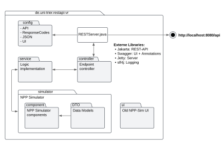

# Nuclear Power Plant Simulator - REST API

Dieses Projekt erweitert eine Nuclear Power Plant Simulation (NPPSimulation) um eine REST API, welche 
die Steuerung sowie Überwachung der Simulation über HTTP-Requests ermöglicht.
Es handelt sich bei dem Projekt um eines von zwei Teilprojekten und dient als Voraussetzung für das Hauptprojekt 
[VR-Reaktor-Leitwarte](https://github.com/RoManN0331/Softwareprojekt_VR-Reaktor-Leitwarte), welches die Reaktorsimulation 
in VR integriert und unterstützende Gaze-Guiding-Elemente implementiert.
Das Projekt wurde im Rahmen des Moduls "Softwarepraktikum" an der Universität Trier im Wintersemester 2024/25 entwickelt.

## Inhalt
- [Installation](#installation)
- [Verwendung](#verwendung)
- [Projektstruktur](#projektstruktur)
- [Dependencies und Materialien](#dependencies-und-materialien)
- [Mitwirkende](#mitwirkende)

## Installation

_Hinweis: Java 14 und Maven werden benötigt_ 

1. Repository klonen:
    ```sh
    git clone https://github.com/RoManN0331/Softwareprojekt_Reaktor-REST-API.git
    cd Softwareprojekt_Reaktor-REST-API
    ```

2. Anschließend Application mit Maven erstellen:
    ```sh
    mvn clean install
    ```
   
## Verwendung
1. Der REST Server kann durch Ausführen der JAR-Datei gestartet werden:
    ```sh
    java -jar target/restapi-vr-1.0.jar
   
    #Alternativ kann die bereitgestellte Jar-Datei verwendet werden:
    java -jar restapi-vr-1.0-final.jar
    ```

2. Der Server kann über die URL `http://localhost:8080` erreicht werden und bietet eine interaktive Dokumentation der verfügbaren Endpunkte:

| Endpunkt         | Funktion                              |
|------------------|---------------------------------------|
| api/control/*    | Steuerung der Kontrollelemente        |
| api/simulation/* | Überwachung der simulations Variablen |
| api/system/*     | Diverse Serverfunktionen              |

Eine vollständige Dokumentation der API und der jeweiligen Endpunkte ist [hier](docs/index.md) verfügbar. 

## Projektstruktur

```plaintext
📦 src
 ┣ 📂 main.java.de.uni_trier         
 ┃ ┣ 📂 restapi_vr                   
 ┃ ┃ ┣ 📂 config                     | Server Configuration
 ┃ ┃ ┣ 📂 controller                 | REST Endpunkt Controller
 ┃ ┃ ┣ 📂 service                    | REST Service Klassen
 ┃ ┃ ┣ 📂 simulator                  | NPP-Simulation
 ┃ ┃ ┃ ┣ 📂 DTO                      | REST Daten Model
 ┃ ┃ ┃ ┗ 📂 component                | NPP-Simulation Komponenten
 ┃ ┃ ┣ 📂 ui                         
 ┃ ┃ ┗ 📄 RESTServer.java            | Main Klasse
 ┃ ┗ 📂 resources                    
 ┃   ┗ 📂 swagger-ui                 | Swagger UI statische Dateien
 ┗ 📂 test                           | Unit Tests
```



## Dependencies und Materialien
- NPP-Simulation: Von [Univ.-Prof. Dr.-Ing. Benjamin Weyers](https://www.uni-trier.de/universitaet/fachbereiche-faecher/fachbereich-iv/faecher/informatikwissenschaften/professuren/human-computer-interaction/team/benjamin-weyers) zur Verfügung gestellt. 
- [Jakarta REST API](https://mvnrepository.com/artifact/jakarta.platform/jakarta.jakartaee-web-api/10.0.0): v10.0.0
- [Jetty Server](https://mvnrepository.com/artifact/org.eclipse.jetty): v11.0.22
- [Swagger UI](https://swagger.io/tools/swagger-ui/): v3.52.0

## Mitwirkende
Teilnehmer des Softwarepraktikums: 
- [Christian Kehl](https://github.com/Chrizzly02)
- [Robert Mersiowsky](https://github.com/rmers)
- [Roman Schander](https://github.com/RoManN0331)
- [Maxim Smirnov](https://github.com/masmir123)